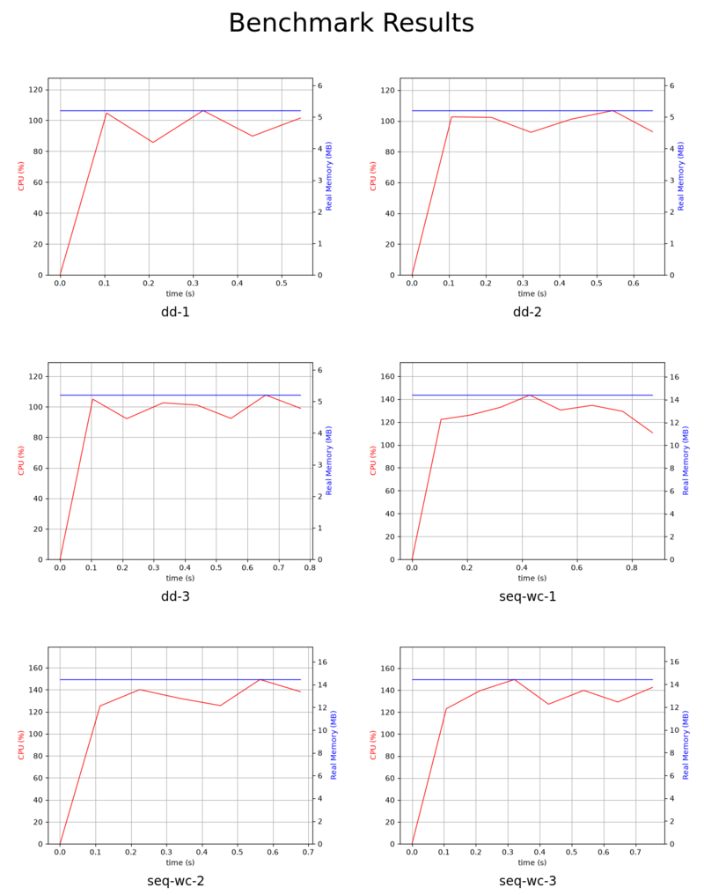

# mtc-bench

[](https://github.com/andrefs/mtc-bench/releases)

Benchmark command execution time, CPU usage, and memory usage using `hyperfine` and `psrecord`.

## Dependencies

- [`hyperfine`](https://github.com/sharkdp/hyperfine) — CLI benchmarking tool for measuring execution time
- [`psrecord`](https://github.com/gaogaotiantian/psrecord) — Monitors CPU and memory usage of a process

## Installing

Run the `install.sh` script to install `mtc-bench` on your `/usr/local/bin` directory.

You can use the `INSTALL_DIR` ENV var to install on another place, e.g.:

```
INSTALL_DIR=$HOME/.local/bin ./install.sh
```

## Getting Started

Run a quick benchmark with two commands:

```bash
mtc-bench 'sleep 2' 'sleep 3'
```

Or read commands from a CSV file (see [Run](#run) for the format):

```bash
mtc-bench -f commands.csv
```

## Comparison with `zbench`

[`zbench`](https://github.com/yxanul/zbench) is another CLI tool for benchmarking command execution. Here's how the two compare:

| Aspect | `mtc-bench` | `zbench` |
|--------|-------------|----------|
| Measurement stack | `hyperfine` → `psrecord` | `perf_event_open` + `wait4` |
| Metrics | Execution time, CPU usage, memory usage | Wall time, peak RSS, hardware counters (cycles, instructions, cache/branch misses) |
| Portability | Anywhere `hyperfine` and `psrecord` run | Linux-only, requires `perf_event_open` access |
| Statistics | Basic timing | Mean ± σ, min/max, outlier detection, two-sample t-test significance |
| Overhead | `psrecord` adds ~0.7s per run | Direct `fork`+`exec`, lower per-run overhead |

Use `mtc-bench` when you need a simple, cross-platform way to time and profile commands with visual output. Use `zbench` when you need fine-grained hardware counter data and statistical significance testing on Linux.

## Rebuilding

The build process uses `App::Fatpacker` to bundle `mtc-bench.pl` together with it's dependencies and generate `mtc-bench`.

If you want to change stuff you should edit `mtc-bench.pl` and in the end run

```
fatpack pack mtc-bench.pl > mtc-bench
```

## Run

Benchmark one or more commands:

```bash
mtc-bench 'CMD1 [ARGS...]' ['CMD2'...]
```

Example:

```bash
mtc-bench 'sleep 2' 'sleep 3'
```

Or read commands from a CSV file using the `-f CMDS_FILE` flag. The file should have a header row, then one command per line:

```csv
label, prepare, command
cmdLabel1, , command1 arg1 arg2
cmdLabel2, , command2
```

## Options

| Flag | Description |
|------|-------------|
| `-h`, `--help` | Print help message |
| `-v`, `--verbose` | Print verbose output |
| `-s`, `--show-output` | Show output of the commands |
| `-p`, `--prepare` | Prepare commands to run before benchmarking. See `hyperfine --help` |
| `-f`, `--file` | Read commands from a CSV file |
| `-d`, `--dry-run` | Just print the command that would be executed |
| `--version` | Print version information |

## ENV vars

You can also change the behavior of `mtc-bench` using the following environment variables:

| Variable | Description |
|----------|-------------|
| `WARMUP` | Number of warmup runs |
| `RES_DIR` | Directory to store results |
| `RUNS` | Number of runs |

## Performance

In `mtc-bench`, `hyperfine` invokes `psrecord`, which in turn invokes the command to be benchmarked.
This means that `hyperfine` is not directly measuring the command's run time, but `psrecord`'s instead.

I ran a few tests on my laptop and `psrecord` seems to add around 0.7s to the command's run time in each run (probably because it is generating the output log and image).
Anyway, it shouldn't change much across runs, so the comparisons between the commands being benchmarked still stand.

### Combined Image

After benchmarking completes, `mtc-bench` automatically generates a combined image (`combined.png`) in the results directory using ImageMagick's `montage`. Each subfigure includes a label identifying which command it corresponds to. Individual command plots (`label-1.png`, `label-2.png`, etc.) are also kept. If ImageMagick is not found, a warning is printed and only the individual images are saved.



## Troubleshooting

- **Command not found**: Make sure `mtc-bench` is installed and in your `PATH`. Run `which mtc-bench` to verify.
- **Dependency error**: Ensure `hyperfine` and `psrecord` are installed and accessible in your `PATH`.
- **CSV parse errors**: Verify your CSV has a header row with `label`, `prepare`, `command` columns and uses commas as delimiters.

## Bugs and stuff

Open a GitHub [issue](https://github.com/andrefs/mtc-bench/issues) or, preferably, send me a [pull request](https://github.com/andrefs/mtc-bench/pulls).

## License

The MIT License (MIT)

Copyright (c) 2024 André Santos — [andrefs@andrefs.com](mailto:andrefs@andrefs.com)

Permission is hereby granted, free of charge, to any person obtaining a copy of this software and associated documentation files (the "Software"), to deal in the Software without restriction, including without limitation the rights to use, copy, modify, merge, publish, distribute, sublicense, and/or sell copies of the Software, and to permit persons to whom the Software is furnished to do so, subject to the following conditions:

The above copyright notice and this permission notice shall be included in all copies or substantial portions of the Software.

THE SOFTWARE IS PROVIDED "AS IS", WITHOUT WARRANTY OF ANY KIND, EXPRESS OR IMPLIED, INCLUDING BUT NOT LIMITED TO THE WARRANTIES OF MERCHANTABILITY, FITNESS FOR A PARTICULAR PURPOSE AND NONINFRINGEMENT. IN NO EVENT SHALL THE AUTHORS OR COPYRIGHT HOLDERS BE LIABLE FOR ANY CLAIM, DAMAGES OR OTHER LIABILITY, WHETHER IN AN ACTION OF CONTRACT, TORT OR OTHERWISE, ARISING FROM, OUT OF OR IN CONNECTION WITH THE SOFTWARE OR THE USE OR OTHER DEALINGS IN THE SOFTWARE.
